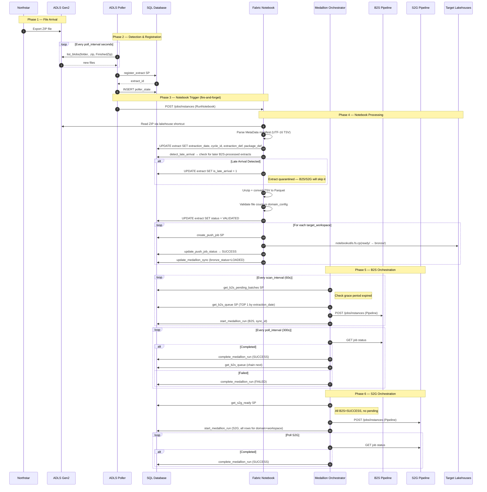
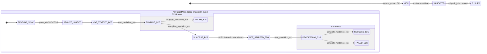
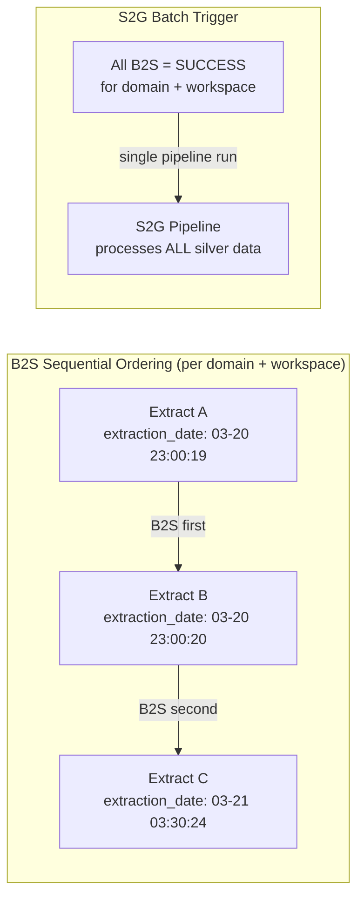
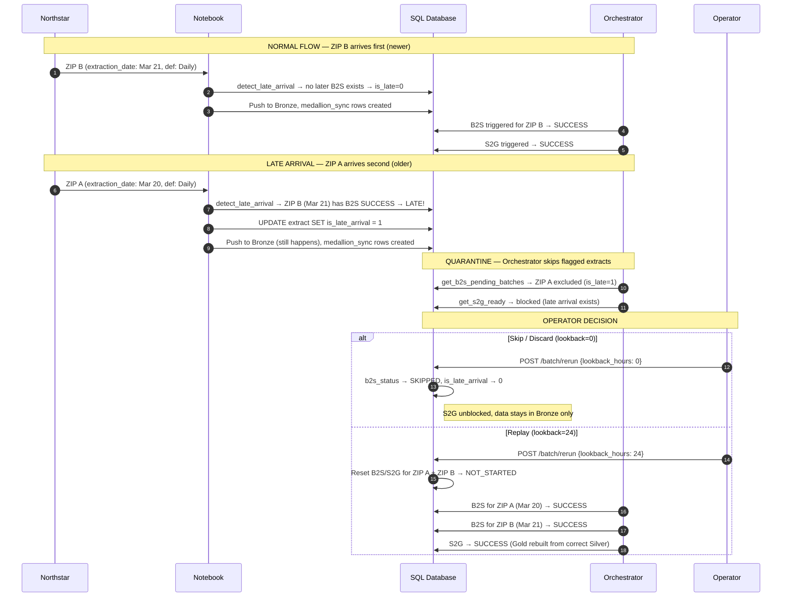

The INS Orchestrator ingests ZIP extracts from Northstar via ADLS Gen2, converts TSV→Parquet, pushes to multiple Fabric workspaces (Bronze), then orchestrates B2S (Bronze→Silver) and S2G (Silver→Gold) Fabric Data Pipelines in the correct order.
Northstar → ADLS Gen2 → Orchestrator → Notebook → Bronze → B2S Pipeline → Silver → S2G Pipeline → Gold
    participant UI as Northstar
- **Source**: Northstar exports ZIP files to an external ADLS Gen2 storage account.
    participant SRC as Northstar
# End-to-End Medallion Pipeline Flow

> **Scope**: Full happy-path flow from ZIP file arrival through Gold layer, plus edge cases.
>
> **Last updated**: 2026-04-17

---

## Table of Contents

1. [System Overview](#1-system-overview)
2. [Component Summary](#2-component-summary)
3. [E2E Sequence Diagram](#3-e2e-sequence-diagram)
4. [Phase-by-Phase Detail](#4-phase-by-phase-detail)
5. [State Machine](#5-state-machine)
6. [B2S Ordering & S2G Batching](#6-b2s-ordering--s2g-batching)
7. [Concurrency Model](#7-concurrency-model)
8. [Configuration Reference](#8-configuration-reference)
9. [Late Arrival Detection](#9-late-arrival-detection)
10. [Known Issues & Bugs](#10-known-issues--bugs)

---

## 1. System Overview

The INS Orchestrator ingests ZIP extracts from Northstar via ADLS Gen2, converts TSV→Parquet, pushes to multiple Fabric workspaces (Bronze), then orchestrates B2S (Bronze→Silver) and S2G (Silver→Gold) Fabric Data Pipelines in the correct order.

```
Northstar → ADLS Gen2 → Orchestrator → Notebook → Bronze → B2S Pipeline → Silver → S2G Pipeline → Gold
```

**Key design principle**: The Orchestrator is the **single brain** — it owns all state and sequencing logic. Fabric Pipelines (B2S/S2G) are stateless workers that only transform data.

---

## 2. Component Summary

| Component | Type | Role |
|-----------|------|------|
| **ADLS Poller** | Background asyncio task in FastAPI | Polls ADLS Gen2 for new `.zip` files containing `FinishedZip` |
| **register_extract SP** | SQL Stored Procedure | Creates extract record, handles idempotency and period superseding |
| **Fabric Notebook** | Fabric Python Notebook | Processes ZIP: parse manifest, TSV→Parquet, validate, push to Bronze |
| **Medallion Orchestrator** | Background asyncio task in FastAPI | Scans for B2S/S2G work, triggers pipelines, polls for completion |
| **B2S Pipeline** | Fabric Data Pipeline | Transforms Bronze→Silver (per extract, per workspace) |
| **S2G Pipeline** | Fabric Data Pipeline | Transforms Silver→Gold (per domain, per workspace) |
| **Fabric SQL Database** | State store | All tables: `extract`, `extract_file`, `push_job`, `medallion_sync`, `target_workspace`, `domain_config`, `poller_state`, `job_log`, `workspace_signal` |
| **fabric_pipeline.py** | Python service | Trigger + poll Fabric pipelines via REST API using Service Principal |
| **fabric_notebook.py** | Python service | Fire-and-forget notebook trigger via Fabric REST API |

---

## 3. E2E Sequence Diagram



---

## 4. Phase-by-Phase Detail

### Phase 1: File Arrival

- **Source**: Northstar exports ZIP files to an external ADLS Gen2 storage account.
- **Naming convention**: `{date}_{time}_{domain}_FinishedZip_{instance}_{report}_{period}.zip`
  - Example: `20260321_033024_SP_FinishedZip_UnisonInsights1ONE1_Daily_2026M03.zip`
- **Contents**: Each ZIP contains:
  - Multiple TSV data files (the actual extract tables)
  - One `MetaData_*.tsv` manifest file (key-value pairs with extraction metadata)

### Phase 2: Detection & Registration

**Service**: `ADLSPollerService` (background asyncio task in `northstar-flow`)

1. **Poll ADLS** every `poll_interval_seconds` (per-source, default 10s; backs off to 5x when idle)
   - Uses SAS token authentication
   - Filters: extension `.zip`, must contain `FinishedZip`
   - Supports **multiple polling sources** via `poller_source` table (each with its own storage account, container, folder, interval)
   - Maintains in-memory `_seen_files` set per source (bootstrapped from `poller_state` table on startup, excluding `FAILED` — enabling retry)
2. **Parse filename** using per-source regex from `poller_source` config to extract `domain_code`, `instance_code`, `report_name`
3. **Call `register_extract` SP**:
   - Idempotent: if `source_file_name` already exists, returns existing `extract_id`
   - Handles period superseding: marks old extract's `is_latest_for_period = 0`
   - Sets initial `status = 'NEW'`
4. **Record in `poller_state`** table (MERGE for retry support of previously FAILED files)
5. **Add to `_seen_files`** set (only if registration succeeded)

### Phase 3: Notebook Trigger

**Service**: `fabric_notebook.py` (called from poller, fire-and-forget)

1. **POST** to Fabric REST API: `/workspaces/{ws_id}/items/{notebook_id}/jobs/instances?jobType=RunNotebook`
2. **Parameters passed**: `EXTRACT_ID` (string), `FILE_NAME` (string), plus `SQL_SERVER` and `SQL_DATABASE` if configured
3. **Non-fatal**: If trigger fails, poller logs warning and continues. Extract remains in `NEW` status for manual intervention.

### Phase 4: Notebook Processing

**Component**: `extract_processor_notebook.Notebook/notebook-content.py` (runs in Fabric)

The notebook executes these steps sequentially:

| Step | Action | Details |
|------|--------|---------|
| 4.1 | **Load extract metadata** | `SELECT` from `dbo.extract` by `extract_id` |
| 4.2 | **Read ZIP** | From `/lakehouse/default/Files/outbound/{file_name}` (ADLS shortcut) |
| 4.3 | **Parse manifest** | Find file starting with `MetaData` (case-insensitive). Detects UTF-16 LE BOM (`ff fe`) vs UTF-8. Parses key-value TSV. Extracts: `ExtractionDate`, `CycleId`, `ExtractionDef`, `PackageDef`. |
| 4.4 | **Store manifest fields** | `UPDATE dbo.extract SET extraction_date=?, cycle_id=?, extraction_def=?, package_def=?` |
| 4.5 | **Detect late arrival** | Queries `medallion_sync` + `extract` for any row with the same `domain_code` + `package_def` but a **later** `extraction_date` that already has `b2s_status IN ('RUNNING','SUCCESS','FAILED')`. If found: sets `is_late_arrival = 1` on the extract and logs to `job_log`. |
| 4.6 | **Unzip & convert** | TSV/CSV → Parquet via Polars. Output to `ready/{domain_code}/{eid}/`. Non-tabular files copied as-is. |
| 4.7 | **Register files** | `INSERT INTO dbo.extract_file` for each output file |
| 4.8 | **Validate** | Check file count against `domain_config.min_expected_files` / `max_expected_files` |
| 4.9 | **Update status** | `UPDATE extract SET status = 'VALIDATED'` (or `VALIDATION_FAILED`) |
| 4.10 | **Process signals** | Check for pending `workspace_signal` rows, acknowledge them |
| 4.11 | **Get target workspaces** | Query `dbo.target_workspace` with filters: `domain_filter`, `instance_filter`, `period_type_filter`, `arrived_after` |
| 4.12 | **Push to Bronze** | For each target workspace: |
| | | a. Call `create_push_job` SP (idempotent) |
| | | b. `UPDATE push_job SET status = 'RUNNING'` |
| | | c. `notebookutils.fs.cp(src_abfss, dst_abfss, recurse=True)` — copies to `bronze/{domain}/{date}/{eid}/` |
| | | d. `UPDATE push_job SET status = 'SUCCESS'` |
| | | e. Call `update_medallion_sync` SP — upserts row with `bronze_status = 'LOADED'`, `b2s_status = 'NOT_STARTED'` |
| 4.13 | **Final status** | `UPDATE extract SET status = 'PUSHED'` |

**Error isolation**: Each target workspace push is independent. A failure on one workspace doesn't block others.

### Phase 5: B2S Orchestration

**Service**: `MedallionOrchestratorService` (background asyncio task in `northstar-flow`)

The orchestrator runs a continuous loop with four phases per scan cycle:

#### 5a. Poll Active Jobs (every `pipeline_poll_interval` seconds, default 300s)

For each active B2S job tracked in-memory (`_active_b2s_jobs`):
1. **GET** `/workspaces/{ws_id}/items/{pipeline_id}/jobs/instances/{job_id}`
2. If `status = "Completed"`:
   - Call `complete_medallion_run` SP (`B2S`, `SUCCESS`)
   - **Immediately chain**: call `_trigger_next_b2s()` for the same `domain + workspace`
3. If `status = "Failed"` or `"Cancelled"`:
   - Call `complete_medallion_run` SP (`B2S`, `FAILED`)
   - **No retry** (manual intervention required)

#### 5b. Check B2S Ready (every `scan_interval` seconds, default 60s)

1. Call `get_b2s_pending_batches` SP — returns `(domain_code, target_workspace_id)` combos where:
   - At least one `medallion_sync` row has `bronze_status = 'LOADED'` AND `b2s_status = 'NOT_STARTED'`
   - **No B2S is currently RUNNING** for this domain+workspace (SP-level guard)
   - Target workspace is `enabled = 1` and has `b2s_pipeline_id` configured
2. **Grace period check** (orchestrator-level):
   - Compare `latest_bronze_loaded_at` against current time
   - If elapsed < `INS_ORCH_B2S_GRACE_PERIOD_MINUTES`, skip (wait for more ZIPs)
3. **In-memory guard**: Skip if `_active_b2s_jobs` already has an entry for this domain+workspace
4. Call `get_b2s_queue` SP — returns **TOP 1** extract ordered by `extraction_date ASC, package_def ASC, extract_id ASC`
5. **Trigger pipeline**: `POST /workspaces/{ws_id}/items/{pipeline_id}/jobs/instances?jobType=Pipeline`
   - Parameters: `extract_id`, `domain_code`, `bronze_folder_path`
6. **Claim row**: Call `start_medallion_run` SP (`B2S`, `sync_id`) — atomically sets `b2s_status = 'RUNNING'`
7. **Track** in `_active_b2s_jobs` dict

#### 5c. B2S → B2S Chaining

When a B2S completes successfully, the orchestrator **immediately** calls `_trigger_next_b2s()`:
- Same domain + workspace
- Gets next extract from `get_b2s_queue` SP (still ordered by `extraction_date ASC`)
- If queue is empty, no action (S2G will be picked up on next scan)

This provides **zero-delay sequential chaining** without waiting for the next scan cycle.

### Phase 6: S2G Orchestration

#### 6a. Check S2G Ready (every `scan_interval` seconds)

1. Call `get_s2g_ready` SP — returns `(domain_code, target_workspace_id)` combos where:
   - **ALL** `medallion_sync` rows for this domain+workspace have `b2s_status = 'SUCCESS'`
   - **No** rows have `b2s_status IN ('NOT_STARTED', 'RUNNING')`
   - At least one row has `s2g_status = 'NOT_STARTED'`
   - No S2G is currently `PROCESSING`
2. **Trigger pipeline**: `POST /workspaces/{ws_id}/items/{pipeline_id}/jobs/instances?jobType=Pipeline`
   - Parameters: `domain_code`
3. **Claim ALL rows**: Call `start_medallion_run` SP (`S2G`, `domain_code`, `target_workspace_id`)
   - Updates all matching rows to `s2g_status = 'PROCESSING'`, same `s2g_run_id`

#### 6b. Poll S2G Jobs

Same as B2S polling. On completion:
- Call `complete_medallion_run` SP (`S2G`, `SUCCESS/FAILED`)
- Updates all rows with matching `s2g_run_id`

### Phase 7: Late Arrival Auto-Replay (every `late_arrival_check_interval`, default 300s)

1. Call `get_late_arrivals_pending` SP with the global threshold (`ins_orch_late_arrival_threshold_hours`, default 48h)
2. Group results by `(domain_code, package_def)`
3. For each group:
   - If `eligible_for_auto_replay = 1` → call `reset_late_arrival_batch` SP with `lookback_hours = threshold`, triggering automatic replay
   - If `eligible_for_auto_replay = 0` and `late_arrival_alerted_at IS NULL` → log a warning and mark `late_arrival_alerted_at` on the extract (requires manual intervention)
4. Stats tracked: `_late_arrivals_auto_replayed`, `_late_arrivals_alerted` (visible in orchestrator status API)

---

## 5. State Machine

### Extract Status Lifecycle



### Status Values

| Table | Column | Values |
|-------|--------|--------|
| `extract` | `status` | `NEW` → `VALIDATED` → `PUSHED` (or `VALIDATION_FAILED`) |
| `extract` | `is_late_arrival` | `0` (normal) / `1` (flagged at notebook time) |
| `push_job` | `status` | `PENDING` → `RUNNING` → `SUCCESS` / `PARTIAL` / `FAILED` / `CANCELLED` |
| `medallion_sync` | `bronze_status` | `PENDING` → `LOADED` |
| `medallion_sync` | `b2s_status` | `NOT_STARTED` → `RUNNING` → `SUCCESS` / `FAILED` / `SKIPPED` |
| `medallion_sync` | `s2g_status` | `NOT_STARTED` → `PROCESSING` → `SUCCESS` / `FAILED` / `SKIPPED` |

---

## 6. B2S Ordering & S2G Batching

### B2S Sequential Processing

B2S runs **one extract at a time per domain+workspace**, ordered by `extraction_date ASC`:



**Enforcement at 3 levels**:

1. **SP Level** (`get_b2s_pending_batches`): `NOT EXISTS` subquery ensures no RUNNING B2S exists for the domain+workspace
2. **Orchestrator Level** (`_check_b2s_ready`): In-memory `_active_b2s_jobs` dict check
3. **Chaining Level** (`_complete_b2s` → `_trigger_next_b2s`): On SUCCESS, immediately picks next from queue

### S2G Batch Triggering

- S2G triggers only when **ALL** B2S are `SUCCESS` and **none** are `NOT_STARTED` or `RUNNING`
- A single S2G pipeline run covers **all** extracts for that domain+workspace
- The `start_medallion_run` SP sets the **same `s2g_run_id`** on all rows

---

## 7. Concurrency Model

### What runs in parallel

| Dimension | Parallel? | Notes |
|-----------|-----------|-------|
| Different **workspaces**, same domain | ✅ Yes | e.g., SP B2S on w_001 and w_003 simultaneously |
| Different **domains**, same workspace | ✅ Yes | e.g., SP B2S and DP B2S on w_001 simultaneously |
| Same domain + same workspace | ❌ No | Strictly sequential by extraction_date |
| Multiple S2G for same domain+workspace | ❌ No | `NOT EXISTS(PROCESSING)` guard |

### Background Services

Both services run as `asyncio.Task` instances inside the FastAPI process (single Gunicorn worker):

| Service | Scan Interval | Poll Interval | Config Key |
|---------|---------------|---------------|------------|
| ADLS Poller | `INS_ORCH_POLL_INTERVAL_SECONDS` (10s, 5x backoff when idle) | — | Polls ADLS (multi-source), triggers notebooks |
| Medallion Orchestrator | `INS_ORCH_MEDALLION_SCAN_INTERVAL_SECONDS` (60s) | `INS_ORCH_PIPELINE_POLL_INTERVAL_SECONDS` (300s) | Scans for work, polls pipeline status |

---

## 8. Configuration Reference

### Environment Variables

| Variable | Default | Description |
|----------|---------|-------------|
| `INS_ORCH_B2S_GRACE_PERIOD_MINUTES` | 5 | Wait time after last bronze push before triggering B2S. Allows multiple ZIPs to arrive before processing starts. |
| `INS_ORCH_PIPELINE_POLL_INTERVAL_SECONDS` | 300 | How often to poll Fabric API for B2S/S2G job completion |
| `INS_ORCH_MEDALLION_SCAN_INTERVAL_SECONDS` | 60 | How often to scan for new B2S/S2G work |
| `INS_ORCH_POLL_INTERVAL_SECONDS` | 10 | ADLS poller base scan interval (backs off to 5x when idle) |
| `INS_ORCH_LATE_ARRIVAL_THRESHOLD_HOURS` | 48 | Max hours after arrival for auto-replay eligibility |
| `INS_ORCH_LATE_ARRIVAL_CHECK_INTERVAL_SECONDS` | 300 | How often the orchestrator checks for late arrivals |

### Database Tables

| Table | Key Fields | Purpose |
|-------|-----------|---------|
| `extract` | `extract_id`, `domain_code`, `extraction_date`, `cycle_id`, `extraction_def`, `package_def`, `is_late_arrival` | Master extract record |
| `extract_file` | `extract_id`, `file_name` | Per-file metadata from conversion |
| `push_job` | `extract_id`, `target_workspace_id` | Tracks Bronze push per workspace |
| `medallion_sync` | `sync_id`, `extract_id`, `target_workspace_id` | B2S/S2G state per extract per workspace |
| `target_workspace` | `target_workspace_id`, `b2s_pipeline_id`, `s2g_pipeline_id` | Workspace config with pipeline IDs |
| `domain_config` | `domain_code` | Validation bounds (`min/max_expected_files`), retry policies (`on_b2s_failure_policy`, `max_retry_attempts`), `extraction_date_cutoff`, `late_arrival_replay_threshold_hours`, `manifest_filename_pattern` |
| `poller_source` | `source_id` | Per-source ADLS polling config: storage account, container, folder, SAS token, poll interval |
| `poller_state` | `file_name`, `source_id` | Tracks detected files per source (idempotency) |
| `workspace_signal` | `signal_id` | Cross-workspace coordination signals |
| `job_log` | `extract_id` | Audit trail |

### Stored Procedures

| SP | Used By | Purpose |
|----|---------|---------|
| `register_extract` | Poller | Create extract, handle superseding |
| `create_push_job` | Notebook | Create push job (idempotent) |
| `update_push_job_status` | Notebook | Mark push RUNNING/SUCCESS/FAILED |
| `update_medallion_sync` | Notebook | Upsert bronze status after push |
| `get_b2s_pending_batches` | Orchestrator | Find domain+workspace combos with pending B2S |
| `get_b2s_queue` | Orchestrator | Get next extract for B2S (TOP 1 by extraction_date) |
| `start_medallion_run` | Orchestrator | Atomically claim sync rows for B2S/S2G |
| `complete_medallion_run` | Orchestrator | Mark B2S/S2G as SUCCESS/FAILED |
| `get_s2g_ready` | Orchestrator | Find domain+workspace combos ready for S2G |
| `reset_late_arrival_batch` | API (`POST /batch/rerun`) + Orchestrator | Reset late arrivals: skip (lookback=0) or replay (lookback>0). Used by both operator API and auto-replay. |
| `get_late_arrivals_pending` | Orchestrator | Find late arrivals eligible for auto-replay (within threshold) or requiring manual alert |
| `get_pending_extracts` | API | Return extracts in pending/new states |
| `create_workspace_signal` | Notebook | Create cross-workspace coordination signal |
| `acknowledge_workspace_signal` | Notebook | Acknowledge processed signal |

---

## 9. Late Arrival Detection

### Overview

B2S is **dependent** — each B2S run reads and writes shared Silver state. If an extract with an older `extraction_date` arrives after a newer one has already been processed through B2S, the newer extract's Silver output may be incomplete (missing the older extract's data). Simply running the late arrival's B2S afterwards won't fix the already-processed Silver.

The system detects late arrivals at **notebook time** and quarantines them until an operator decides how to handle them.

### Design Principles

1. **Detection at ingest, not orchestration** — The notebook (`detect_late_arrival()`) checks at Step 4.5 whether any extract with the same `domain_code + package_def` but a **later** `extraction_date` has already started or completed B2S.
2. **Quarantine + auto-replay** — Late arrivals are flagged (`is_late_arrival = 1`) and excluded from B2S/S2G. The orchestrator auto-replays within a configurable threshold (`late_arrival_replay_threshold_hours`, default 48h per domain). Beyond threshold, an alert is logged and manual intervention is required via `POST /medallion-sync/batch/rerun`.
3. **Batch = `domain_code + package_def`** — Late arrival is scoped to the batch. A late SP/Daily doesn't affect SP/Weekly or DP/Daily.
4. **Lookback-scoped replay** — When replaying (auto or manual), `lookback_hours` controls how far back to reset, avoiding unbounded replays.

### Detection Logic (Notebook)

```python
def detect_late_arrival(eid, domain_code, extraction_def, extraction_date, package_def=None) -> bool:
    """
    Query: SELECT COUNT(*) FROM medallion_sync ms
           JOIN extract e ON ms.extract_id = e.extract_id
           WHERE e.domain_code = ? AND e.package_def = ?
             AND e.extraction_date > ?
             AND ms.b2s_status IN ('RUNNING', 'SUCCESS', 'FAILED')
    
    If count > 0: this extract is late. Set is_late_arrival = 1.
    Sequence scope: domain_code + package_def (extraction_def is irrelevant).
    """
```

**Placement in notebook flow**: After manifest parsing (Step 4.4), before file registration (Step 4.6). The extract is still processed normally (unzip, push to Bronze) — it's just flagged so the orchestrator skips it.

### SP Guards (Orchestrator)

Late arrivals are excluded from B2S/S2G processing at the SP level:

| SP | Guard Added |
|----|-------------|
| `get_b2s_pending_batches` | `AND e.[is_late_arrival] = 0` — excludes flagged extracts from pending count |
| `get_b2s_queue` | `AND e.[is_late_arrival] = 0` — never returns a flagged extract for B2S |
| `get_s2g_ready` | `NOT EXISTS` subquery — blocks S2G for the `domain_code + package_def` scope if any extract has `is_late_arrival = 1` |

### S2G Blocking

S2G is blocked when late arrivals exist because:
- S2G does a full rebuild from Silver
- If a late arrival hasn't been replayed yet, running S2G would produce Gold from incomplete Silver
- The operator must resolve the late arrival first (skip or replay), then S2G can proceed

### Operator API: Batch Rerun

```
POST /medallion-sync/batch/rerun
```

**Request body** (`BatchRerunRequest`):
```json
{
    "domain_code": "SP",
    "lookback_hours": 24,
    "extraction_def": "Daily",
    "package_def": "UnisonInsights1ONE1",
    "target_workspace_id": null
}
```

| Parameter | Required | Description |
|-----------|----------|-------------|
| `domain_code` | Yes | Domain to reset |
| `lookback_hours` | Yes | `0` = skip/discard, `>0` = replay window |
| `extraction_def` | No | Scope to a specific extraction definition |
| `package_def` | No | Scope to a specific package definition |
| `target_workspace_id` | No | Scope to a specific target workspace |

#### Mode: Skip/Discard (`lookback_hours = 0`)

- Sets `b2s_status = 'SKIPPED'` and `s2g_status = 'SKIPPED'` on the late arrival's `medallion_sync` rows
- Clears `is_late_arrival = 0` on the extract
- The late arrival is effectively discarded — its data stays in Bronze but is never processed through Silver/Gold
- S2G is unblocked for the domain+workspace

#### Mode: Replay (`lookback_hours > 0`)

- Finds the earliest `extraction_date` among the late arrivals
- Calculates a reset boundary: `max(earliest_late_date, now - lookback_hours)`
- Resets `b2s_status = 'NOT_STARTED'` and `s2g_status = 'NOT_STARTED'` for **all** extracts in the batch with `extraction_date >= reset_boundary`
- Clears `is_late_arrival = 0` on the flagged extracts
- The orchestrator will re-process B2S in the correct `extraction_date` order, then trigger S2G

**Response** (`BatchRerunResponse`):
```json
{
    "extracts_reset": 3,
    "syncs_reset": 9,
    "lookback_hours": 24,
    "domain_code": "SP",
    "extraction_def": "Daily",
    "package_def": "UnisonInsights1ONE1",
    "affected_extracts": [...]
}
```

### Dashboard Visibility

The `GET /medallion-sync/dashboard` endpoint reports late arrival counts per domain+workspace:

| New Dashboard Fields | Description |
|---------------------|-------------|
| `late_arrivals` | Count of extracts with `is_late_arrival = 1` |
| `b2s_skipped` | Count of sync rows with `b2s_status = 'SKIPPED'` |
| `s2g_skipped` | Count of sync rows with `s2g_status = 'SKIPPED'` |

### Late Arrival Sequence Diagram



### Schema Changes

**Baseline table definitions**:
- `northstar-flow-DB/Tables/extract.sql`
- `northstar-flow-DB/Tables/domain_config.sql`

| Column | Type | Default | Purpose |
|--------|------|---------|---------|
| `extract.package_def` | `NVARCHAR(200)` | `NULL` | From manifest `PackageDef` field — identifies the source package within an extraction run |
| `extract.is_late_arrival` | `BIT` | `0` | Flag set by notebook when a later extraction_date has already been B2S processed |

---

## 10. Known Issues & Bugs

### Bug: Same Extraction Run → Multiple Packages ≠ Late Arrival

**Status**: Known — detection works as designed, but test setup was initially confusing.

**Scenario**: An extraction run (e.g., `Daily` on `2026-03-21T03:30:24`) may produce **multiple ZIPs** with different `PackageDef` values (e.g., `UnisonInsights1ONE1`, `UnisonInsights1ONE2`). These are different packages from the **same extraction run**, not late arrivals.

```
ZIP A: extraction_date=2026-03-21T03:30:24, extraction_def=Daily, package_def=UnisonInsights1ONE2
ZIP B: extraction_date=2026-03-21T03:30:24, extraction_def=Daily, package_def=UnisonInsights1ONE1
```

**Why this is NOT a late arrival**: Both ZIPs have the **same `extraction_date`**. The `detect_late_arrival()` function checks for `e.extraction_date > ?` (strictly greater), so same-date extracts correctly pass through as normal.

**Key insight**: `extraction_date` is the extraction run timestamp (when the source system ran the export), NOT the arrival time. Multiple ZIPs with the same `extraction_date` are **peer packages from one run**, not duplicates or late arrivals.

**To test late arrival detection**: Two ZIPs with the same `domain_code` + `extraction_def` but **different `extraction_date`** values are required. Upload the newer one first, let it process through B2S, then upload the older one.

---

*Document generated from live system analysis. All component references verified against codebase as of 2026-04-17.*
